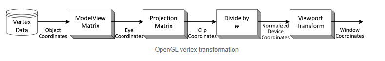

## Initial Resources

-   <https://github.com/zauonlok/renderer/>
-   <https://github.com/ssloy/tinyrenderer/wiki/>
-   <http://www.songho.ca/opengl/>

## Frames of reference in 3d modelling

**Vertex Data/Object Coordinates (3D):** There's the local frame of reference for an object. As far as I can tell, it's essentially that all the 3d points of a model are between [-1,1] ie if you load in just the raw values that's what you'd get.

**Model/Eye Coordinates (3D):** Then there's the world frame of reference. For example, imagine I have a cube where the vertices are located at (-1,-1,-1), (1,-1,-1), (1,1,-1).... then I want to transform it to a specific location in my world, say the center of the cube (0,0,0) is located at (0,10,0). Then all the points in the model should be shifted by that much. The model space is also merged together with the concept of a camera.

Say we have an object at (0,0,-1) and a camera at (0,0,0). Then our eye coordinates are what we'd if we looked directly at the object. The Model matrix and the View matrix are merged together to create the ModelView matrix and directly translates it into eye coordinates.

For another example, let's say our object is at (0,0,0) and our camera is at (0,0,-10). In OpenGL, the camera must always be at (0,0,0) and looking down the -Z axis. So first we translate the entire space. The object is now at (0,0,10). The camera is ONLY allowed to look down the -Z axis so now the entire scene needs to rotate 180 degrees.

To allow translations this now needs to be 4D

**Clip Coordinates (4D):** This one I'm not as certain about. Eye coordinates are multiple by a projection matrix to become the clip coordinates. The matrix defines the viewing volume (frustum) and how the vertex data are projected onto the screen (perspective or orthogonal)

**Normalized Device Coordinates (NDC) (3D):** Dividing by the clip coordinates and scaled to [-1,1]

**Window Coordinates/Screen Coordinates (3D):** Scale and translate so that (0,0) is located at the center of the screen (W/2, H/2)

## A general coding outline

We have two major functions to implement: a `vertex_shader()` and a `fragment_shader()` . A `rasterize_triangle()` function is called PER FACE and it calls the vertex and fragment shader.

The `vertex_shader()`'s main goal is to take the object coordinates and transform it into `clip_coord`inates. The secondary goal is to fill in the necessary `varyings`. In the case of zauonlok's first implementation, the shader takes in the position vertex, transforms it as necessary from the transformation uniform, returning the new clip coordinates. The varyings are just the tex coordinates and are just directly passed from input tex coords to the output texcoords.
