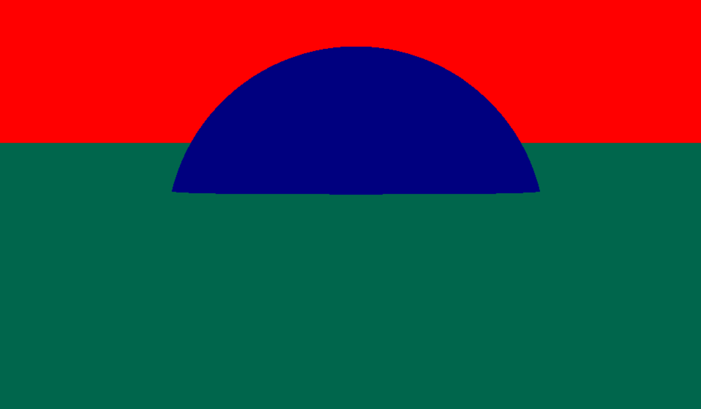

## The basic idea

One way of rendering a 3D world or scene onto a 2D picture is via raytracing. Raytracing is conceptually simple: we imagine our picture is a window into the 3D scene. For each pixel of an image we simulating shooting a ray of light out, and every object the ray touches (is our kingdom) determines the color of the pixel.

## Setting up the render buffer (or how we're drawing the image)

To start we need some way of creating an image by specifying the color of each pixel. In this case I'm using SDL. Then main bloops code needed to get started are

``` cpp
// setup
if (SDL_Init(SDL_INIT_EVERYTHING) == 0)
SDL_Window   *window   = SDL_CreateWindow(NULL,
                                           SDL_WINDOWPOS_CENTERED, SDL_WINDOWPOS_CENTERED,
                                           Width, Height, SDL_WINDOW_BORDERLESS);
SDL_Renderer *renderer = SDL_CreateRenderer(window, -1, 0);
SDL_Texture  *texture  = SDL_CreateTexture(renderer,
                                           SDL_PIXELFORMAT_ARGB8888,
                                           SDL_TEXTUREACCESS_STREAMING,
                                           Width, Height);
//blit
SDL_UpdateTexture(texture, NULL, Pixels, (int)(Width * sizeof(u32)));
SDL_RenderCopyEx(renderer, texture, NULL, NULL, 0, NULL, SDL_FLIP_VERTICAL);
SDL_RenderPresent(renderer);
```

Where pixels is a pointer to memory. Then writing to memory is as simple as writing the loop

``` cpp
u32 *Out = Pixels;
for(u32 Y = 0; Y < Height; ++Y)
{
  for(u32 X = 0; X < Width; ++X)
  {
    *Out++ = 0xFFFF0000;
  }
}
```

or whatever color you're looking for. We now have an easy way to create and see an image. The next step is to create our types for the world. We'll start with spheres, planes, materials, and out world struct.

``` cpp
typedef struct
{
  v3f P;
  f32 r;
  u32 MatIndex;
} sphere;

typedef struct
{
  v3f N;
  f32 d;
  u32 MatIndex;
} plane;

typedef struct
{
  v3f EmitColor;
  v3f RefColor
} material;
  

typedef struct
{
  u32 MaterialCount;
  material *Materials;
  
  u32 PlaneCount;
  plane *Planes;
  
  u32 SphereCount;
  sphere *Spheres;
} world;


// Initialize some stuff

material Materials[3] = {};
Materials[0].EmitColor = {0.3,0.4,0.5};
Materials[1].EmitColor = {0.5,0.4,0.3};
Materials[2].EmitColor = {0.0,0.0,0.3};

plane Planes[1] = {};
Planes[0].N = {0,0,1};
Planes[0].MatIndex = 1;


sphere Spheres[1] = {};
Spheres[0].P = {0,0,0};
Spheres[0].r = 2.0f;
```

Okay so now we've developed our structs and initialized some objects to raytrace, i.e. position some planes and spheres in a world. The planes and spheres have a specific coordinate system. By convention we'll pick a right-handed coordinate system with positive Z is up, positive-Y is forward, and positive X is right (imagining I'm a character placed at 0,0,0 in the world. We will then place a Camera somewhere in the world from which to shoot rays. It's convenient to define a Camera axis system. In this case we'll use the OpenGL convention that the camera looks down the negative-Z axis, up the screen is positive-Y, and positive-X is right.

``` cpp

v3f CameraP = {0,-10,1};
v3f CameraZ = normalize(CameraP); // CameraP - WorldOrigin
v3f CameraX = v3f{0,0,1} ^ CameraZ;
v3f CameraY = CameraZ ^ CameraX;
```

We now imagine there's a Film sitting in front of the Camera at a distance 1.0 with normalized coordinates (-1,1) on both sides. Our image is "cast" onto this film. While define the Film dimensions to be 1x1 for now. The main purpose of the FilmW and FilmH is to be able to adjust the aspect ratio?

``` cpp
f32 FilmDist = 1.0;
f32 FilmW = 1.0;
f32 FilmH = 1.0;
f32 HalfFilmW = 0.5 * FilmW;
f32 HalfFilmY = 0.5 * FilmH;


for(u32 Y = 0; Y < Height; ++Y)
{
  f32 FilmY = -1 + 2.0 * (f32) Y / Height;
  for(u32 X = 0; X < Width; ++X)
  {
    f32 FilmX = -1 + 2.0 * (f32) X / Width;
    
    v3f RayOrigin = CameraP;
    v3f RayDirection = normalize(FilmDist  * -1.0*CameraZ + 
                                 HalfFilmW * FilmX * CameraX + 
                                 HalfFIlmY * FilmY * CameraY);
    
    v3f color = Raycast(World, Image, RayDirection, RayOrigin);
    
    
  }
}
```

Now we need to cast rays. For each ray we loop through all the planes and spheres and determine if the objects are hit.

``` cpp
v3f color Raycast(world World, image_u32 Image, v3f RayDirection, v3f RayOrigin)
{
  
  v3f color = {};
  u32 HitMatIndex = 0;
  f32 HitDistance = FLT_MAX;
  
  for(u32 PlaneIndex = 0; PlaneIndex < World.PlaneCount; ++PlaneIndex)
  {
    plane Plane = World.Planes[PlaneIndex];
    
    f32 Denom = Inner(RayDirection, Plane.N);
    if((Denom < -Tolerance) || (Denom > Tolerance))
    {
      f32 t = -(Inner(RayOrigin, Plane.N) + Plane.d) / Denom;
      if(t < HitDistance && t > 0)
      {
        HitDistance = t;
        HitMatIndex = Plane.MatIndex;
      }
      
    }
  }
  
  for(u32 SphereIndex = 0; SphereIndex < World.SphereCount; ++SphereIndex)
  {
    f32 a = Inner(RayDirection, RayDirection);
    v3f OffsetSphereOrigin = RayOrigin - Sphere.P;
    f32 b = 2.0 * Inner(RayDirection, OffsetSphereOrigin);
    f32 c = Inner(OffsetSphereOrigin, OffsetSphereOrigin) - Sphere.r * Sphere.r;
    
    f32 RootTerm = sqrt(b*b - 4.0f * a * c);
    if(RootTerm > Tolerance)
    {
      t = (-b - RootTerm) / (2.0 * a);
      if(t < HitDistance && t > Tolerance)
      {
        HitDistance = t;
        HitMatIndex = Sphere.MatIndex;
      }
    }
    
  }
  
  material Material = World.Materials[HitMatIndex];
  v3f color = Material.EmitColor;
  
}
```



This is nice but returns very flat colors. We should calculate a new bounce location for each object. Also we will not make each object emit color, some will only reflect colors. A light ray hitting an object reflecting a color will be attenuated by that reflect color, and then continue on. When the ray hits an emission source we then attenuate the emit color by the accumulated attenuation value. Let's adjust our structs

``` cpp
typedef struct
{
  v3f P;
  f32 r;
  u32 MatIndex;
} sphere;

typedef struct
{
  v3f N;
  f32 d;
  u32 MatIndex;
} plane;

typedef struct
{
  f32 Specular
  v3f EmitColor;
  v3f RefColor
} material;
  

typedef struct
{
  u32 MaterialCount;
  material *Materials;
  
  u32 PlaneCount;
  plane *Planes;
  
  u32 SphereCount;
  sphere *Spheres;
} world;


// Initialize some stuff

material Materials[3] = {};
Materials[0].EmitColor = {0.3,0.4,0.5};
Materials[1].RefColor = {0.5,0.5,0.5};
Materials[2].RefColor = {0.7,0.5,0.3};

plane Planes[1] = {};
Planes[0].N = {0,0,1};
Planes[0].MatIndex = 1;


sphere Spheres[1] = {};
Spheres[0].P = {0,0,0};
Spheres[0].r = 1.0f;
Spheres[1].MatIndex = 2;
```

And now let's add a loop of bounces for each raycast. When the ray hits an object, we need to calculate a new origin and new direction (but we'll record the normal of the hit location instead and then compute the bounce location after). Once we're finished looping through all the planes and spheres, we'll check if we hit something. If so first see if there's an emit color and add it into the color vector (with the emit color being hadamard-product'd (lol) by the attenuation). Then compute the new attenuation via the reflect color. Then continue looping. If we don't hit an object, then stop the bounces.

``` cpp
v3f color Raycast(world World, image_u32 Image, v3f RayDirection, v3f RayOrigin)
{
  
  v3f NextOrigin = {};
  v3f NextNormal = {};
  
  u32 MaxBounces = 8;
  
  v3f Color = {0,0,0};
  v3f Attenuation = {1,1,1};
  f32 Tolerance = 0.0001f;
  
  for(u32 BounceIndex = 0; BounceIndex < MaxBounces; ++BounceIndex)
  {
    u32 HitMatIndex = 0;
    f32 HitDistance = FLT_MAX;
    
    for(u32 PlaneIndex = 0; PlaneIndex < World.PlaneCount; ++PlaneIndex)
    {
      plane Plane = World.Planes[PlaneIndex];
      
      f32 Denom = Inner(RayDirection, Plane.N);
      if((Denom < -Tolerance) || (Denom > Tolerance))
      {
        f32 t = -(Inner(RayOrigin, Plane.N) + Plane.d) / Denom;
        if(t < HitDistance && t > 0)
        {
          HitDistance = t;
          HitMatIndex = Plane.MatIndex;
          NextOrigin = t*RayDirection + RayOrigin;
          NextNormal = Plane.N;
        }
        
      }
    }
    
    for(u32 SphereIndex = 0; SphereIndex < World.SphereCount; ++SphereIndex)
    {
      f32 a = Inner(RayDirection, RayDirection);
      v3f OffsetSphereOrigin = RayOrigin - Sphere.P;
      f32 b = 2.0 * Inner(RayDirection, OffsetSphereOrigin);
      f32 c = Inner(OffsetSphereOrigin, OffsetSphereOrigin) - Sphere.r * Sphere.r;
      
      f32 RootTerm = sqrt(b*b - 4.0f * a * c);
      if(RootTerm > Tolerance)
      {
        t = (-b - RootTerm) / (2.0 * a);
        if(t < HitDistance && t > Tolerance)
        {
          HitDistance = t;
          HitMatIndex = Sphere.MatIndex;
          NextOrigin = t*RayDirection + RayOrigin;
          NextNormal = normalize(NextOrigin - Sphere.P);
        }
      }
    }
    
    material Material = World.Materials[HitMatIndex];
    Color = Color + Hadamard(Attenuation, Materials.EmitColor);
    
    if(HitMatIndex!=0)
    {
      Attenuation = Hadamard(Attenuation, Material.RefColor);
      RayOrigin = NextOrigin;
      v3f PureBounce = RayDirection - 2.0 * Inner(RayDirection, Normal) * Normal;
      RayDirection = PureBounce;
    }
    else
    {
      break;
    }
  }
  return(Color);
  
}
```

Of course the ray direction shouldn't just be a pure bounce otherwise you can get very strange looking images (even if they're apparently correct) with everything reflecting. To implement random bounces we need a random number

``` cpp
#include <stdlib.h>

f32 RandomUnilaterial()
{
  f32 r = rand() / (f32) RAND_MAX; //not FLT_MAX lol
  return(r);
}

f32 RandomBilateral()
{
  f32 r = -1.0 + 2.0 * RandomUnilateral;
  return(r);
}

v3f color Raycast(world World, image_u32 Image, v3f RayDirection, v3f RayOrigin)
{
  
  v3f NextOrigin = {};
  v3f NextNormal = {};
  
  u32 MaxBounces = 8;
  
  v3f Color = {0,0,0};
  v3f Attenuation = {1,1,1};
  
  for(u32 BounceIndex = 0; BounceIndex < MaxBounces; ++BounceIndex)
  {
    u32 HitMatIndex = 0;
    f32 HitDistance = FLT_MAX;
    
    for(u32 PlaneIndex = 0; PlaneIndex < World.PlaneCount; ++PlaneIndex)
    {
      plane Plane = World.Planes[PlaneIndex];
      
      f32 Denom = Inner(RayDirection, Plane.N);
      if((Denom < -Tolerance) || (Denom > Tolerance))
      {
        f32 t = -(Inner(RayOrigin, Plane.N) + Plane.d) / Denom;
        if(t < HitDistance && t > 0)
        {
          HitDistance = t;
          HitMatIndex = Plane.MatIndex;
          NextOrigin = t*RayDirection + RayOrigin;
          NextNormal = Plane.N;
        }
        
      }
    }
    
    for(u32 SphereIndex = 0; SphereIndex < World.SphereCount; ++SphereIndex)
    {
      f32 a = Inner(RayDirection, RayDirection);
      v3f OffsetSphereOrigin = RayOrigin - Sphere.P;
      f32 b = 2.0 * Inner(RayDirection, OffsetSphereOrigin);
      f32 c = Inner(OffsetSphereOrigin, OffsetSphereOrigin) - Sphere.r * Sphere.r;
      
      f32 RootTerm = sqrt(b*b - 4.0f * a * c);
      if(RootTerm > Tolerance)
      {
        t = (-b - RootTerm) / (2.0 * a);
        if(t < HitDistance && t > Tolerance)
        {
          HitDistance = t;
          HitMatIndex = Sphere.MatIndex;
          NextOrigin = t*RayDirection + RayOrigin;
          NextNormal = normalize(NextOrigin - Sphere.P);
        }
      }
    }
    
    material Material = World.Materials[HitMatIndex];
    Color = Color + Hadamard(Attenuation, Materials.EmitColor);
    
    if(HitMatIndex!=0)
    {
      Attenuation = Hadamard(Attenuation, Material.RefColor);
      RayOrigin = NextOrigin;
      v3f PureBounce = normalize(RayDirection - 
                                2.0 * Inner(RayDirection, Normal) * Normal);
      v3f RandomBounce = normalize(NextNormal + 
                  v3f{RandomBilateral(),RandomBilateral(),RandomBilateral() })
      RayDirection = PureBounce * Material.Scatter + RandomBounce * (1-Material.Scatter);
    }
    else
    {
      break;
    }
  }
  return(Color);
  
}


f32 FilmDist = 1.0;
f32 FilmH = 1.0;
f32 FilmW = 1.0;
if(Image.Height < Image.Width)
{
  FilmH = (f32)Image.Height/Image.Width;
}
if(Image.Width < Image.Height)
{
  FilmW = (f32)Image.Width/Image.Height;
}
f32 HalfFilmW = 0.5 * FilmW;
f32 HalfFilmH = 0.5 * FilmH;


f32 PixW = 1.0f / Image.Width;
f32 PixH = 1.0f / Image.Height;
f32 HalfPixW = 0.5 * PixW;
f32 HalfPixH = 0.5 * PixH;

for(u32 Y = 0; Y < Image.Height; ++Y)
{
  f32 FilmY = -1.0  + 2.0 * (f32) Y / Image.Height;
  for(u32 X = 0; X < Image.Width; ++X)
  {
    f32 FilmX = -1.0  + 2.0 * (f32) X / Image.Width;
    
    f32 OffX = FilmX + HalfPixW + HalfPixW * RandomBilateral();
    f32 OffY = FilmY + HalfPixH + HalfPixH * RandomBilateral();
    
    v3f RayOrigin = CameraP;
    v3f RayDirection = FilmDist * -1.0*CameraZ + 
                       HalfFilmW * OffX * CameraX + 
                       HalfFilmY * OffY * CameraY;
    
    color = Raycast(World, Image, RayDirection, RayOrigin);
    
    *Out++ = ARGBPack(color);
  }
}
```

Finally we can cast multiple rays per pixel and average the values. The resulting values might need to be clamped.

``` cpp


u32 RaysPerPixel = 16;
f32 Contrib = 1.0 / RaysPerPixel;
v3f color = {0,0,0};
for(u32 Y = 0; Y < Image.Height; ++Y)
{
  f32 FilmY = -1.0  + 2.0 * (f32) Y / Image.Height;
  for(u32 X = 0; X < Image.Width; ++X)
  {
    f32 FilmX = -1.0  + 2.0 * (f32) X / Image.Width;
    
    for(u32 RayIndex = 0; RayIndex < RaysPerPixel; ++RayIndex)
    {
       f32 OffX = FilmX + HalfPixW + HalfPixW * RandomBilateral();
       f32 OffY = FilmY + HalfPixH + HalfPixH * RandomBilateral();
       
       v3f RayOrigin = CameraP;
       v3f RayDirection = FilmDist * -1.0*CameraZ + 
                          HalfFilmW * OffX * CameraX + 
                          HalfFilmY * OffY * CameraY;
       
       color = color + Contrib*Raycast(World, Image, RayDirection, RayOrigin);
    }
    
   
    
    *Out++ = ARGBPack(color);
  }
}
```
